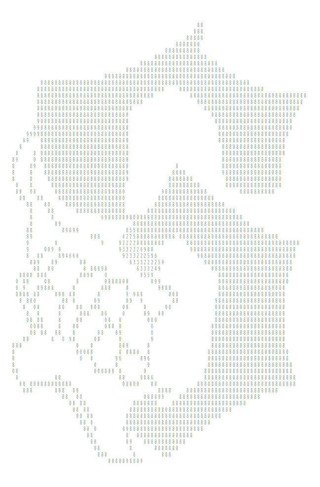
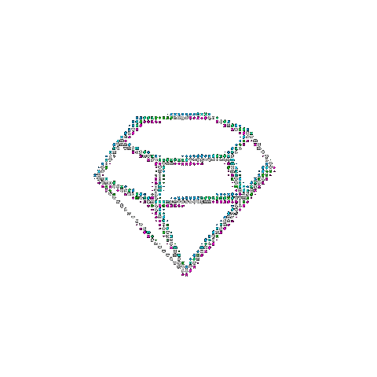

<!--
  README de perfil — Khan64-07
  Concepto: el perfil se presenta como una sesión de terminal.
  Cada bloque plegable (<details>) es un "comando" que se abre al pulsarlo.

  ✏️ EDITAR: busca este símbolo en los comentarios — son los puntos donde
  deberías volver con el tiempo (nuevas skills, proyectos, contacto, etc.)

  Nota técnica: las imágenes usan <picture> con prefers-color-scheme para
  que se vean bien tanto en el tema claro como en el oscuro de GitHub,
  y todas tienen fondo transparente — nada de rectángulos de color pisando
  la página. Assets propios (súbelos a esas rutas en la raíz del repo):
  assets/moon.svg    → sección "mood.log"
  assets/six-code.svg → sección "about.md" (columna derecha)
  assets/roadmap.gif → sección "roadmap.todo" (columna derecha)
-->

<div align="center">

```text
[ ok ] loading profile: khan64-07
[ ok ] status: building fundamentals
[....] next boot → javascript · c++ · sql
```

<picture>
  <source media="(prefers-color-scheme: dark)" srcset="https://readme-typing-svg.demolab.com/?font=Fira+Code&size=15&duration=2800&pause=900&color=FFFFFF&center=true&vCenter=true&width=560&height=42&lines=khan64-07%40dev%3A~%24%20whoami;%3E%20estudiante%20%C2%B7%2019%20a%C3%B1os%20%C2%B7%20esp%C3%B1a;khan64-07%40dev%3A~%24%20cat%20status.log;%3E%20aprendiendo%20python%20%2B%20git;khan64-07%40dev%3A~%24%20./next_level.sh;%3E%20javascript%20%C2%B7%20c%2B%2B%20%C2%B7%20sql">
  <source media="(prefers-color-scheme: light)" srcset="https://readme-typing-svg.demolab.com/?font=Fira+Code&size=15&duration=2800&pause=900&color=1a1a1a&center=true&vCenter=true&width=560&height=42&lines=khan64-07%40dev%3A~%24%20whoami;%3E%20estudiante%20%C2%B7%2019%20a%C3%B1os%20%C2%B7%20esp%C3%B1a;khan64-07%40dev%3A~%24%20cat%20status.log;%3E%20aprendiendo%20python%20%2B%20git;khan64-07%40dev%3A~%24%20./next_level.sh;%3E%20javascript%20%C2%B7%20c%2B%2B%20%C2%B7%20sql">
  
</picture>

<sub>19 años · España · aprendiendo a programar, un commit a la vez</sub>

</div>

---

<details open>
<summary><code>$ cat about.md</code></summary>
<br>

<table>
<tr>
<td width="65%" valign="top">

Empecé hace muy poco: cuenta configurada, primeras líneas en Python y ya
perdiendo horas en la terminal por gusto. No hay atajos — voy entendiendo
cada cosa desde la base antes de pasar a la siguiente. Este README es,
literalmente, mi `git log` como estudiante: cambia de forma en cuanto
tengo algo nuevo que contar.

<!-- ✏️ EDITAR: cuando tengas más claro tu enfoque (web, datos, backend, juegos...) cuéntalo aquí -->

</td>
<td width="35%" align="center" valign="middle">



</td>
</tr>
</table>

</details>

### `$ ls ./skills`

```text
skills/
├── ready/
│   ├── python          # + librerías, frameworks, etc.
│   ├── git
|   ├── dsa
│   └── markdown
└── building/
    ├── javascript      # + librerías, por decidir
    ├── typescript
    ├── sql
    ├── java
    ├── go (golang)
    └── c++
```

<!-- ✏️ EDITAR: cuando domines algo de "building/", muévelo a "ready/".
     Añade librerías concretas en cuanto las elijas (numpy, pandas, react...) -->



### `$ cat roadmap.todo`

- [x] Fundamentos de Python
- [x] Git y control de versiones
- [ ] Librerías de Python (datos / automatización)
- [ ] JavaScript + librerías
- [ ] TypeScript (dominio sobre JavaScript)                  
- [ ] SQL y bases de datos
- [ ] Java / GO
- [ ] C++
- [ ] Primer proyecto completo publicado
- [ ] Primera contibución open-source

<!-- ✏️ EDITAR: marca lo que vayas completando, añade filas nuevas cuando te propongas otra meta -->

<br clear="right">

---

<details>
<summary><code>$ git log --graph --activity</code></summary>
<br>

<div align="center">

<picture>
  <source media="(prefers-color-scheme: dark)" srcset="https://github-readme-activity-graph.vercel.app/graph?username=Khan64-07&bg_color=00000000&color=ffffff&line=ffffff&point=ffffff&area=false&hide_border=true&hide_title=true">
  <source media="(prefers-color-scheme: light)" srcset="https://github-readme-activity-graph.vercel.app/graph?username=Khan64-07&bg_color=00000000&color=1a1a1a&line=1a1a1a&point=1a1a1a&area=false&hide_border=true&hide_title=true">
  
</picture>

</div>

</details>

<details>
<summary><code>$ cat mood.log</code></summary>
<br>

<div align="center">


<sub>sesiones de código nocturnas con maratón de anime de fondo<br>el modo enfoque se activa después de medianoche</sub>

</div>

</details>

<details>
<summary><code>$ cat contact.txt</code></summary>
<br>

Por ahora, GitHub es el mejor sitio para encontrarme.

<!-- ✏️ EDITAR: añade aquí LinkedIn, correo, portfolio, etc. cuando los tengas.
     Ejemplo:
     [LinkedIn](https://linkedin.com/in/tu-usuario) · [Correo](mailto:tu@correo.com) -->

</details>

---

<div align="center">
<sub>este archivo cambia a medida que yo cambio · última edición: julio 2026</sub>
</div>
