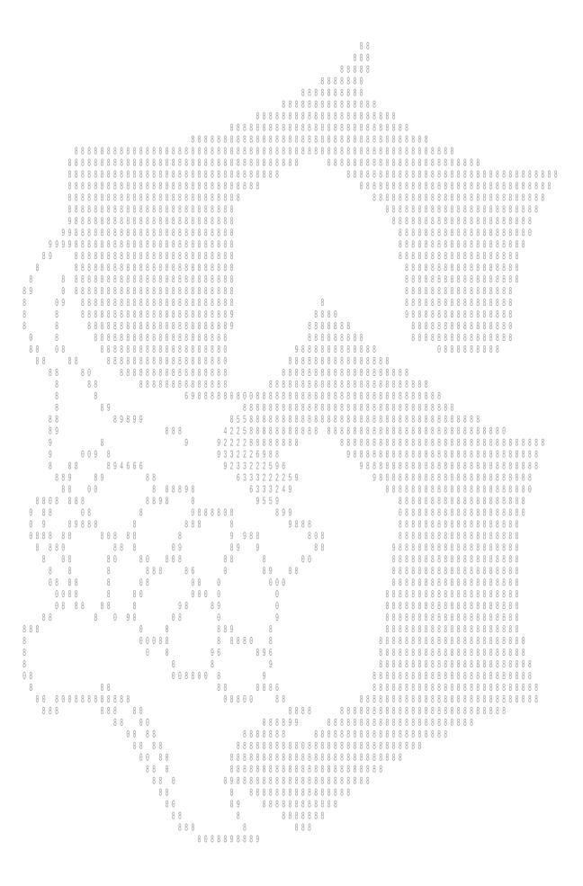

<!--
  README de perfil — Khan64-07
  Concepto: el perfil se presenta como una sesión de terminal.
  Cada bloque plegable (<details>) es un "comando" que se abre al pulsarlo.

  ✏️ EDITAR: busca este símbolo en los comentarios — son los puntos donde
  deberías volver con el tiempo (nuevas skills, proyectos, contacto, etc.)

  Nota técnica: las imágenes usan <picture> con prefers-color-scheme para
  que se vean bien tanto en el tema claro como en el oscuro de GitHub,
  y todas tienen fondo transparente — nada de rectángulos de color pisando
  la página. Assets propios (súbelos a esas rutas en la raíz del repo):
  assets/moon.svg    → sección "mood.log"
  assets/six-code.svg → sección "about.md" (columna derecha)
  assets/roadmap.gif → sección "roadmap.todo" (columna derecha)
-->

<div align="center">

```text
[ ok ] loading profile: khan64-07
[ ok ] status: building fundamentals
[....] next boot → sql · javascript · typescript
```

<picture>
  <source media="(prefers-color-scheme: dark)" srcset="https://readme-typing-svg.demolab.com/?font=Fira+Code&size=15&duration=2800&pause=900&color=FFFFFF&center=true&vCenter=true&width=560&height=42&lines=khan64-07%40dev%3A~%24%20whoami">
  <source media="(prefers-color-scheme: light)" srcset="https://readme-typing-svg.demolab.com/?font=Fira+Code&size=15&duration=2800&pause=900&color=1a1a1a&center=true&vCenter=true&width=560&height=42&lines=khan64-07%40dev%3A~%24%20whoami">
  
</picture>

<sub>2007· España(Spain) · programmer, a commit at a time</sub>

</div>

---

<details open>
<summary><code>$ cat about.md</code></summary>
<br>

<table>
<tr>
<td width="65%" valign="top">

I started just recently: account set up, first lines of Python written, and already
happily losing hours in the terminal. There are no shortcuts—I’m grasping
each concept from the ground up before moving on to the next. This README is,
literally, my programmer `git log`: it evolves whenever I have something new to share.

<!-- ✏️ EDITAR: cuando tengas más claro tu enfoque (web, datos, backend, juegos...) cuéntalo aquí -->

</td>
<td width="35%" align="center" valign="middle">



</td>
</tr>
</table>

</details>

### `$ ls ./skills`

```text
skills/
├── ready/
│   ├── python          # + libreries, frameworks, etc.
│   ├── git
│   ├── dsa
│   └── markdown
└── building/
    ├── sql
    ├── javascript      # + libreries, to decide.
    ├── typescript
    ├── java
    └── rust
```

<!-- ✏️ EDITAR: cuando domines algo de "building/", muévelo a "ready/".
     Añade librerías concretas en cuanto las elijas (numpy, pandas, react...) -->

<br clear="right">

---

<details open>
<summary><code>$ cat mood.log</code></summary>
<br>

<div align="center">


<sub>"Code is like humor. When you have to explain it, it's bad.".<br>— Cory House</sub>

</div>

</details>

<details open>
<summary><code>$ cat contact.txt</code></summary>
<br>

For now, GitHub is the best place to find me.
<!-- ✏️ EDITAR: añade aquí LinkedIn, correo, portfolio, etc. cuando los tengas.
     Ejemplo:
     [LinkedIn](https://linkedin.com/in/tu-usuario) · [Correo](mailto:tu@correo.com) -->

</details>

---

<div align="center">
<sub>This file changes as I change.</sub>
</div>
